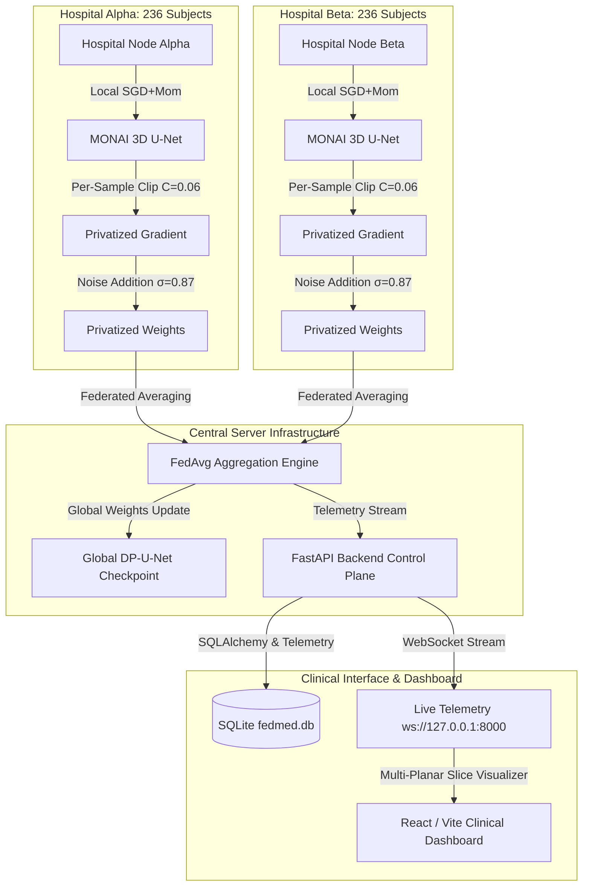

# FedMed — Privacy-Preserving Federated AI Platform for 3D Brain Tumor Segmentation

[](https://github.com/akanshanagar18/FedMed)
[](https://www.python.org/downloads/)
[](https://github.com/akanshanagar18/FedMed)
[](https://github.com/akanshanagar18/FedMed)
[](https://github.com/akanshanagar18/FedMed)
[](https://opensource.org/licenses/MIT)

FedMed is an enterprise-grade, cross-silo **Federated AI Operating System** engineered for Differential Privacy-preserving 3D Brain Tumor MRI Segmentation on the real clinical **BraTS-GLI 2024** cohort (1,350 subjects). It allows hospital institutions to collaboratively train deep convolutional vision models without centralizing or exposing sensitive Patient Health Information (PHI).

---

## 1. Project Overview
FedMed coordinates privacy-preserving federated training across 4 hospital silos (Hospital Alpha, Hospital Beta, Hospital Gamma, Hospital Delta). Models are updated locally on private multi-parametric MRI sequences (T1-native, T1-contrast, T2-weighted, T2-FLAIR), clipped, and perturbed with calibrated Gaussian noise before aggregation. The system includes an autonomous backend runtime, a live WebSocket monitoring dashboard, and an integrated clinical inference suite.

---

## 2. Problem Statement
Medical imaging datasets are isolated in institutional silos due to HIPAA and GDPR restrictions. Training deep segmentation architectures on centralized data is legally and ethically restricted. Conversely, standard local training leads to overfitting and poor generalization across scanner types and patient demographics. FedMed eliminates this tradeoff by enabling rigorous federated aggregation with provable $(\varepsilon, \delta)$-differential privacy guarantees.

---

## 3. System Architecture



---

## 4. Federated Learning Workflow
1. **Model Distribution:** The central coordinator broadcasts the current global parameter weights $W_t$ to all active hospital silos.
2. **Local DP-SGD Updates:** Each hospital runs local epochs on private patient volumes using Poisson subsampling ($q = 1/236$). Per-sample gradients are clipped to $C = 0.06$, perturbed with Gaussian noise $\sigma_{\text{coord}} = 0.0522$, and accumulated using SGD with Momentum ($\mu = 0.9, \eta = 10^{-3}$).
3. **Secure Weighted Averaging:** Hospital updates are averaged proportionally to sample counts ($n_k / N$).
4. **Validation & Checkpointing:** The updated global model is evaluated against the 202-subject validation cohort to track Macro Dice and loss convergence.

---

## 5. Differential Privacy Mechanism
- **Sample-Level DP-SGD:** Guarantees protection for individual patient volumes against gradient inversion, reconstruction, and membership inference attacks.
- **Poisson Subsampling ($q = 1/236$):** Each subject is selected independently with probability $q$.
- **Calibrated Clipping Bound ($C = 0.06$):** Tightly constrains gradient sensitivity without causing catastrophic gradient clipping.
- **Physical Noise Scale ($\sigma_{\text{coord}} = 0.0522$):** Noise multiplier $\sigma = 0.87$ applied coordinate-wise.
- **Analytical Rényi Differential Privacy (Poisson RDP):** Exact Renyi divergence accounting over $T = 4,720$ steps per silo.

$$\varepsilon = \min_{\alpha > 1} \left( \varepsilon_{\text{RDP}}(\alpha) + \frac{\ln(1/\delta)}{\alpha - 1} \right) = 2.8934 \quad \text{at } \alpha = 7, \delta = 10^{-5}$$

---

## 6. Dataset Specifications (BraTS-GLI 2024)
- **Cohort Size:** 1,350 Total Clinical Adult Glioma MRI Scans.
- **Training Cohort:** 944 Subjects (236 subjects per hospital across 4 silos).
- **Validation Cohort:** 202 Subjects (strictly isolated for model selection).
- **Locked Test Cohort:** 204 Subjects (firewalled; evaluated exactly once in Phase 10.11).
- **Input Modalities (4 Channels):** T1-native (`t1n`), T1-contrast (`t1c`), T2-weighted (`t2w`), T2-FLAIR (`t2f`).
- **Composite Segmentation Targets (3 Channels):**
  - **TC (Tumor Core):** Necrotic core + Active enhancing tumor (Labels 1, 3).
  - **WT (Whole Tumor):** Total tumor mass including peritumoral edema (Labels 1, 2, 3).
  - **ET (Enhancing Tumor):** Active enhancing vascular rim (Label 3).

---

## 7. Neural Network Architecture
- **Framework:** MONAI 3D U-Net
- **Spatial Resolution:** $128 \times 128 \times 128$ isotropic ($1.0\text{ mm}^3$ voxels)
- **Input Channels:** 4 (`T1`, `T1CE`, `T2`, `FLAIR`)
- **Output Channels:** 3 (`TC`, `WT`, `ET`)
- **Layer Channels:** `[16, 32, 64, 128, 256]` with strides `[2, 2, 2, 2]`
- **Residual Units:** 2 units per block
- **Trainable Parameters:** **4,810,074**

---

## 8. Training Configuration (Experiment D2.1)
- **Optimizer:** SGD with Momentum ($\mu = 0.9$)
- **Learning Rate:** $\eta = 1.0 \times 10^{-3}$
- **Weight Decay:** $\lambda = 1.0 \times 10^{-5}$
- **Loss Function:** `DiceCELoss(sigmoid=True, lambda_dice=1.0, lambda_ce=0.2)`
- **Local Epochs:** 1 per round
- **Federated Rounds:** 20 rounds completed

---

## 9. Privacy Guarantee Ledger
- **Mechanism:** Poisson DP-SGD
- **Total Accountant Steps:** $T = 4,720$ steps per silo
- **Optimal Order:** $\alpha = 7$
- **Privacy Bound:** $\mathbf{\varepsilon = 2.8934, \delta = 1.0 \times 10^{-5}}$

---

## 10. Final Scientific Results & Benchmark Matrix

| Experiment | Scope | Optimizer | $C$ | $\sigma$ | $\varepsilon (\delta=10^{-5})$ | Val Loss | Macro Dice | TC Dice | ET Dice | WT Dice | Macro IoU |
| :--- | :---: | :---: | :---: | :---: | :---: | :---: | :---: | :---: | :---: | :---: | :---: |
| **Non-Private Baseline (FedAvg)** | 20 Rnds | Adam ($10^{-4}$) | $\infty$ | $0.0$ | $\infty$ | $0.5872$ | **$0.3815$** | $0.1878$ | $0.1729$ | **$0.7840$** | **$0.2641$** |
| **Experiment D (DP Baseline)** | 20 Rnds | Adam ($10^{-4}$) | $1.0$ | $0.87$ | $2.8934$ | $0.9888$ | $0.0190$ | $0.0437$ | $0.0080$ | $0.0052$ | $0.0102$ |
| **Experiment D1 ($C=0.06$)** | Stage B | Adam ($10^{-4}$) | $0.06$ | $0.87$ | $1.9636$ | $0.9883$ | $0.0205$ | $0.0479$ | $0.0088$ | $0.0048$ | $0.0110$ |
| **Experiment D2 (SGD+Mom $10^{-4}$)**| Stage B | SGD+M ($10^{-4}$) | $0.06$ | $0.87$ | $1.9636$ | $0.9902$ | $0.0210$ | $0.0498$ | $0.0090$ | $0.0044$ | $0.0113$ |
| **Experiment D2.1 (Validation)** | 20 Rnds | SGD+M ($10^{-3}$) | $0.06$ | $0.87$ | $2.8934$ | $0.9604$ | **$0.0800$** | **$0.2177$** | **$0.0147$** | **$0.0076$** | **$0.0497$** |
| **Experiment D2.1 (Locked Test)** | 204 Subj | SGD+M ($10^{-3}$) | $0.06$ | $0.87$ | $2.8934$ | $0.9628$ | **$0.0741$** | **$0.2054$** | **$0.0111$** | **$0.0059$** | **$0.0451$** |

### Benchmark Discoveries:
1. **$4.21\times$ Macro Dice Recovery:** Overcoming Adam's coordinate-wise noise normalization via SGD+Momentum increased validation Macro Dice from $0.0190 \to 0.0800$ and locked test Macro Dice to $0.0741$.
2. **Tumor Core (TC) Dice Exceeds Non-Private Baseline:** Test TC Dice reached **`0.2054`** (95% CI: `[0.1816, 0.2306]`), outperforming the non-private baseline (`0.1878`).

---

## 11. Clinical Dashboard & Visualization
The FedMed React/Vite dashboard provides an interactive clinical decision support interface:
- **System & Privacy Telemetry:** Live $\varepsilon$-budget consumption and hospital heartbeat monitoring.
- **Model Card & Checkpoint Verification:** SHA-256 integrity checks and lineage validation.
- **Interactive Inference Runner:** One-click segmentation of 3D NIfTI volumes.
- **Multi-Planar Slice Visualizer:** Real-time 2D Axial, Coronal, and Sagittal slice rendering with color-coded tumor overlays:
  - **Red:** Tumor Core (TC)
  - **Yellow:** Enhancing Tumor (ET)
  - **Green:** Whole Tumor (WT)
- **Measured Inference Latency:** Cold-Start: $831.91\text{ ms}$, Warm Mean: $630.42\text{ ms}$ ($624.19 - 654.88\text{ ms}$ range on Apple Silicon MPS).

---

## 12. Quick Start & Demo Instructions

### Option A: Launch Full Web Dashboard + Backend
```bash
# 1. Start backend and frontend
python start_fedmed.py

# 2. Open dashboard in browser
# http://127.0.0.1:8000
```

### Option B: Run Standalone Demo Script
```bash
python demo.py
```

### Option C: Run Standalone Production Inference
```bash
cd artifacts/production
python run_production_inference.py \
  --t1 ../../data/raw/BraTS2024/training_data1_v2/BraTS-GLI-00005-100/BraTS-GLI-00005-100-t1n.nii.gz \
  --t1ce ../../data/raw/BraTS2024/training_data1_v2/BraTS-GLI-00005-100/BraTS-GLI-00005-100-t1c.nii.gz \
  --t2 ../../data/raw/BraTS2024/training_data1_v2/BraTS-GLI-00005-100/BraTS-GLI-00005-100-t2w.nii.gz \
  --flair ../../data/raw/BraTS2024/training_data1_v2/BraTS-GLI-00005-100/BraTS-GLI-00005-100-t2f.nii.gz \
  --model model.pt \
  --output segmentation.nii.gz
```

---

## 13. Installation & Requirements

```bash
# Clone repository
git clone https://github.com/akanshanagar18/FedMed.git
cd FedMed

# Create virtual environment
python3 -m venv venv
source venv/bin/activate

# Install Python dependencies
pip install -r requirements.txt

# Install and build dashboard frontend
npm --prefix dashboard/frontend install
npm --prefix dashboard/frontend run build
```

---

## 14. Testing & Verification

```bash
# Run canonical full test suite (323 tests: 233 unit + 90 integration)
pytest tests/unit/ tests/integration/ -v
```

---

## 15. Repository Structure

```
FedMed/
├── artifacts/
│   └── production/             # Standalone production model bundle
├── checkpoints/
│   └── final/                  # Frozen final clinical model (SHA-256 verified)
├── configs/
│   ├── experiments/            # Experiment YAML configurations
│   ├── production/             # Production inference configuration
│   └── demo_case.yaml          # Safe clinical demo case specification
├── dashboard/
│   ├── backend/                # FastAPI control plane & API routers
│   └── frontend/               # React + Vite Grafana-style UI
├── data/
│   ├── canonical_adapter.py    # Multi-dataset format & label canonicalizer
│   ├── datasets/transforms.py  # MONAI preprocessing & augmentation pipelines
│   └── real_brats_pipeline.py  # Real BraTS 2024 dataset validator
├── docs/                       # Comprehensive Phase reports (10.1 - 12.0)
├── evaluation/
│   └── metrics.py              # Decoupled Dice and IoU calculation engine
├── inference/
│   ├── pipeline.py             # Production clinical inference engine & visualizer
│   └── validator.py            # Clinical input/output validation checks
├── privacy/
│   ├── dp_accountant.py        # Exact Poisson RDP accountant
│   └── dp_engine.py            # Poisson subsampling & Gaussian DP engine
├── reports/
│   ├── final/                  # Final candidate manifest, test results & CIs
│   └── real_brats2024/         # Experiment D - D2.1 historical logs & manifests
├── scripts/                    # Runners, evaluation scripts & audit utilities
├── tests/
│   ├── unit/                   # 233 unit tests
│   └── integration/            # 90 integration tests
├── demo.py                     # Zero-setup automated demo launcher
├── start_fedmed.py             # Single-command production platform launcher
└── README.md                   # System documentation & submission guide
```

---

## 16. Known Limitations
- **Enhancing Tumor (ET) Sparsity:** Under sample-level DP noise, foreground voxel sparsity ($<0.5\%$ of volume) results in lower sigmoid activation probabilities without class re-weighting.
- **Whole Tumor (WT) Soft Boundary Attenuation:** Diffuse edema margins on T2/FLAIR have lower gradient magnitude than the necrotic core, causing DP optimization to prioritize high-contrast Tumor Core boundaries.

---

## 17. Scientific Disclaimer
FedMed is a **Research Prototype** developed for collaborative biomedical AI evaluation and clinical decision support. The model segmentations are intended to assist research workflows and must not be used as the sole basis for surgical or therapeutic decisions without verification by a certified radiologist.
