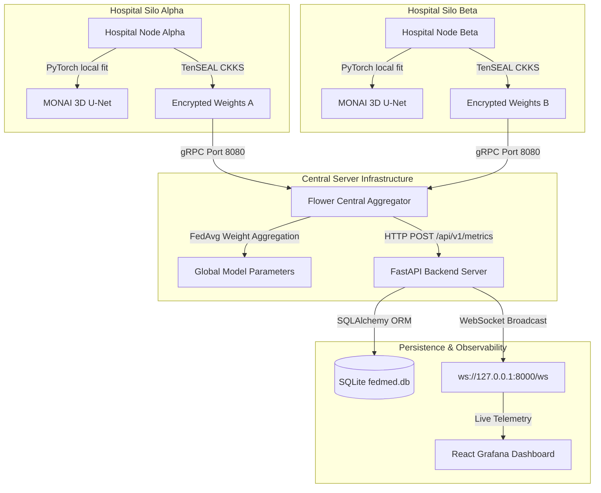

# FedMed v2.0 — Enterprise Federated AI Platform for Medical Image Segmentation (RC-1)

[](https://github.com/akanshanagar18/FedMed)
[](https://www.python.org/downloads/)
[](file:///Users/siddhant_patil/Projects/FedMed)
[](https://opensource.org/licenses/MIT)

FedMed v2.0 is a production-grade, cross-silo **Enterprise Federated AI Platform** engineered for privacy-preserving 3D Brain Tumor MRI Segmentation (**BraTS**). It empowers healthcare institutions and medical research facilities to collaboratively train MONAI 3D U-Net models without exposing sensitive Patient Health Information (PHI).


---

## 🌟 Executive Overview & Problem Statement

Medical imaging datasets are severely fragmented across hospitals due to strict data privacy regulations (HIPAA, GDPR). Centralizing patient MRI scans for model training is legally and ethically impossible. 

**FedMed solves this dilemma by bringing model training to the data:**
* **Decentralized Local Training:** Hospital client nodes train PyTorch MONAI models on private local MRI scans.
* **Homomorphic Encryption:** Model parameters are protected using **TenSEAL CKKS** homomorphic encryption before egress.
* **Central Aggregation:** The Flower FL server aggregates encrypted weight updates via **FedAvg** without accessing raw patient data.
* **Real-time Telemetry:** A FastAPI backend and React Grafana-style monitoring dashboard stream live training loss and Dice similarity score metrics over WebSockets.

---

## 🏗️ System Architecture



---

## 🛠️ Technology Stack

| Domain | Technology | Purpose |
| :--- | :--- | :--- |
| **Deep Learning** | PyTorch 2.x, MONAI 1.3+ | 3D U-Net Architecture & BraTS MRI Tensor Pipelines |
| **Federated Engine** | Flower (`flwr`) 1.7+ | Cross-silo gRPC Client-Server Orchestration & FedAvg Strategy |
| **Privacy Preserving**| TenSEAL 0.3+ | CKKS Scheme Homomorphic Vector Encryption |
| **Backend API** | FastAPI, Uvicorn, SQLAlchemy | REST API, SQLite Persistence & WebSocket Broadcasting |
| **Frontend UI** | React 18, Recharts, Vite | Grafana/Prometheus-style Dark Telemetry Dashboard |
| **Testing & CI** | Pytest, GitHub Actions | Automated Regression Suite & Continuous Integration |

---

## 📁 Repository Folder Structure

```text
FedMed/
├── client/                 # Flower NumPyClient implementation for hospital nodes
├── common/                 # Canonical Pydantic schemas and shared type definitions
├── configs/                # Centralized environment settings & system constants
├── dashboard/              # Full-stack monitoring platform
│   ├── backend/            # FastAPI REST & WebSocket server
│   └── frontend/           # React + Recharts dashboard UI
├── data/                   # Dataset directory for MRI volumes
├── docs/                   # Platform documentation (Architecture, API, Demo, Dev)
├── model/                  # PyTorch MONAI 3D U-Net model and trainer
├── privacy/                # TenSEAL CKKS homomorphic encryption utilities
├── scripts/                # Production simulation orchestrator script
├── server/                 # Flower central server with custom MetricsReporter strategy
├── tests/                  # Automated pytest suite (unit, integration, e2e)
├── .github/                # CI workflows, issue templates, and PR guidance
├── pyproject.toml          # Packaging setup and tool configurations
├── pytest.ini              # Pytest framework settings
└── requirements.txt        # Production dependency manifest
```

---

## 🚀 Standardized Execution Entrypoints

All platform operations are standardized via `Makefile` from the repository root:

```bash
# 1. Zero-Setup Enterprise Demo (Single Command)
make demo             # Or: python3 demo.py

# 2. Launch FastAPI Backend Server (Port 8000)
make backend          # Or: uvicorn app.main:app --app-dir dashboard/backend --port 8000

# 3. Launch React Frontend Dev Server (Port 3000)
make frontend         # Or: cd dashboard/frontend && npm run dev

# 4. Execute Multi-Hospital Federated Learning Simulation
make simulation       # Or: python3 scripts/run_simulation.py

# 5. Launch Containerized Platform Stack via Docker Compose
make compose          # Or: docker compose up --build -d
```

### 🌐 Accessing System Services
Once launched, open your browser:
* **Live Dashboard UI:** `http://127.0.0.1:8000/` (or `http://localhost:3000` in dev)
* **Swagger API Docs:** `http://127.0.0.1:8000/docs`
* **WebSocket Telemetry Stream:** `ws://127.0.0.1:8000/api/v1/telemetry/ws`
* **MLflow Tracking UI:** `http://127.0.0.1:5000` (`make mlflow`)
* **TensorBoard UI:** `http://127.0.0.1:6006` (`make tensorboard`)

---

## 🧪 Automated Testing & CI Pipeline

Run the automated test suite from repository root:

```bash
# Run complete test suite (Unit, Integration, E2E)
make test             # Or: pytest

# Run specific test suites
make test-unit        # Or: pytest tests/unit
make test-integration # Or: pytest tests/integration
make test-e2e         # Or: pytest tests/e2e
```


### GitHub Actions Integration
Every push to `main` or feature branches automatically triggers `.github/workflows/ci.yml`, running unit, integration, and e2e smoke tests on Ubuntu environments.

---

## 📚 Detailed Documentation

* [Architecture Specification](docs/architecture.md) — Sequence diagrams & subsystem protocols
* [REST & WebSocket API Guide](docs/api.md) — Endpoint specifications & JSON contracts
* [Developer & Contributor Guide](docs/developer_guide.md) — Adding models, nodes, and local debugging
* [3-Minute Live Demonstration Script](docs/demo.md) — Judge walkthrough guide

---

## 📄 License & Legal

Distributed under the **MIT License**. See [LICENSE](LICENSE) for details.
