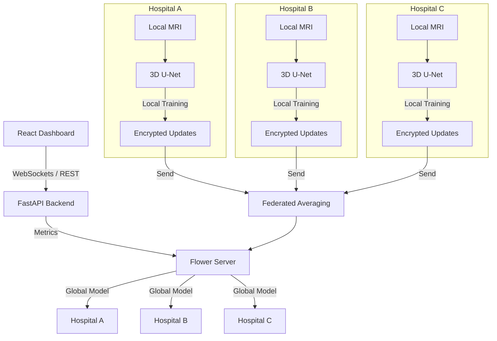

# FedMed


## Project Description

**FedMed** is a Privacy-Preserving Machine Learning (PPML) engine designed to enable multiple hospitals to collaboratively train deep learning models for Medical Image Segmentation without ever sharing sensitive patient data. 

By leveraging **Federated Learning** and **Homomorphic Encryption**, FedMed addresses the critical bottleneck in healthcare AI: the inability to aggregate sufficient, diverse datasets due to strict privacy regulations (HIPAA, GDPR). Federated learning matters because it moves the *model* to the *data*, not the data to the model.

## Problem Statement

Developing highly accurate AI models for rare diseases, such as Brain Tumors, requires massive datasets. Hospitals cannot legally share patient MRI data. As a result, hospitals train isolated models that become less accurate because each institution has limited data.

## Real World Use Case

Three hospitals (Hospital A, B, and C) collaborate to train a Brain Tumor Segmentation model. Each hospital owns private MRI scans.
1. The central server initializes a PyTorch 3D U-Net model.
2. The model is sent to every hospital.
3. Hospitals train locally on their private data.
4. Weights are encrypted.
5. Encrypted updates are transmitted to the central server.
6. The server aggregates them using Federated Averaging.
7. A new global model is generated, and the process repeats until convergence.

No MRI image ever leaves the hospital.

## System Architecture



## Core Technologies

| Module | Technologies |
|---|---|
| **Federated Learning** | Flower (flwr), gRPC |
| **Deep Learning** | PyTorch, MONAI |
| **Data Processing** | NumPy, OpenCV, Nibabel |
| **Privacy & Encryption** | TenSEAL |
| **Backend & APIs** | FastAPI, Uvicorn, WebSockets |
| **Frontend Dashboard** | React, Tailwind CSS, Recharts |
| **Database (Monitoring)** | SQLite |

## Project Modules

- **Federated Learning:** Core orchestration using Flower. Manages training rounds, gRPC communication, and FedAvg weight aggregation.
- **Medical Imaging:** PyTorch/MONAI implementation of the 3D U-Net for Brain Tumor MRI Segmentation (BraTS dataset).
- **Privacy:** Homomorphic encryption wrapper using TenSEAL to encrypt weight updates, ensuring the central server cannot reverse-engineer patient data.
- **Dashboard:** A real-time monitoring interface for experiment tracking, hospital connection status, and training metrics.

## Repository Structure

- `client/`: Federated learning client node implementation.
- `server/`: Centralized Flower server and aggregation logic.
- `model/`: Neural network architectures, loss functions, and evaluation metrics.
- `privacy/`: Encryption algorithms and differential privacy wrappers.
- `dashboard/`: Full-stack monitoring application (React frontend, FastAPI backend).
- `configs/`: Centralized configuration management and hyperparameters.
- `common/`: Shared schemas, types, and generic functions used across modules.
- `utils/`: Domain-specific processing utilities.
- `docs/`: Technical documentation and project guidelines.
- `tests/`: Unit and integration testing suites.
- `scripts/`: Helper bash/python scripts for environment setup.

## Development Roadmap

- **Phase 1:** Foundation - Repository architecture, packaging, and standards established.
- **Phase 2:** FL Core - Basic Flower server/client orchestration with mock data.
- **Phase 3:** Deep Learning - Integration of 3D U-Net and BraTS data loader.
- **Phase 4:** Privacy - TenSEAL integration for secure aggregation.
- **Phase 5:** Monitoring - Full-stack Dashboard deployment.

## Git Workflow

The project uses a standard Gitflow-inspired branching model:
- `main`: Production-ready releases only.
- `development`: Main integration branch. All features target this branch.
- `feature/*` (e.g., `feature/federated-learning`, `feature/medical-model`): Feature branches branched off `development`.

## Getting Started

*(Placeholders for future setup instructions once Phase 2 is complete)*
```bash
# Clone the repository
# Create virtual environment
# pip install -e .
# Start Server
# Start Clients
```

## Current Progress

- ✅ Project Architecture Completed
- ⬜ Medical Model
- ⬜ Federated Learning
- ⬜ Privacy Layer
- ⬜ Dashboard

## Future Scope

- Integration with Kubernetes for distributed large-scale simulation.
- Support for Differential Privacy alongside Homomorphic Encryption.
- Expanding segmentation models to vision transformers (ViT).

## Contributors

- [Contributor Placeholders]

## License

- [License Placeholder]
