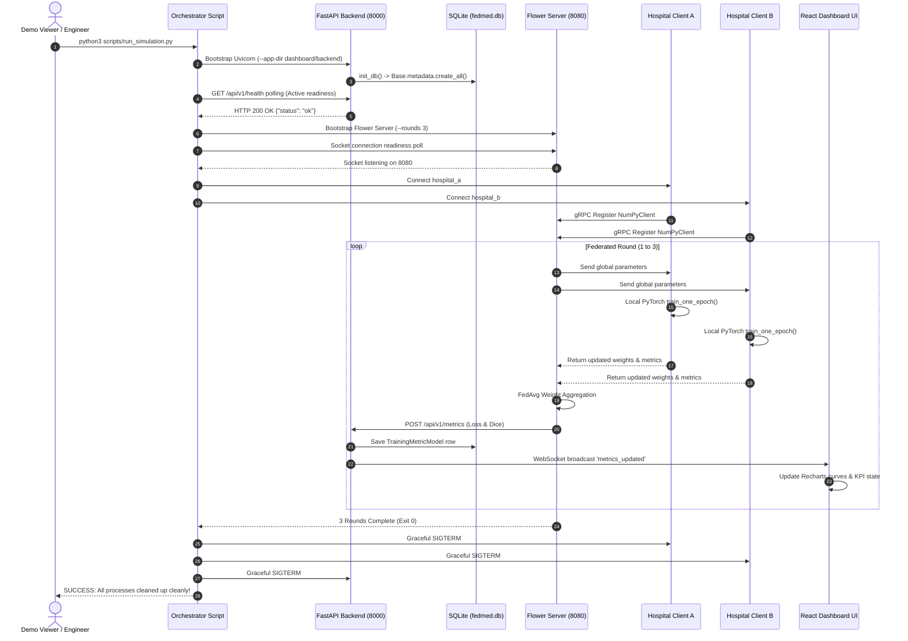

# FedMed Architecture Specification

## 1. Subsystem Overview

FedMed is structured into 6 decoupled core subsystems designed for fault isolation and horizontal scaling.

---

## 2. Component Technical Specifications

### A. Medical Machine Learning Layer (`model/`)
* **Architecture:** 3D U-Net configured for 4-channel MRI input (`T1`, `T1ce`, `T2`, `FLAIR`) and 3-channel binary mask output (`Tumor Core`, `Whole Tumor`, `Enhancing Tumor`).
* **Trainer:** `model/trainer.py` executes local PyTorch gradient updates using `BCEWithLogitsLoss` and computes Dice Similarity Coefficients (DSC).

### B. Federated Learning Layer (`client/` & `server/`)
* **Server:** `server/flower_server.py` extends Flower's `FedAvg` with a custom `MetricsReporterStrategy` that issues asynchronous HTTP POST calls to the FastAPI backend upon round completion.
* **Client:** `client/flower_client.py` extends `flwr.client.NumPyClient`, training locally on synthetic BraTS tensors before serializing parameters.

### C. Homomorphic Privacy Layer (`privacy/`)
* **Scheme:** TenSEAL CKKS (Cheon-Kim-Kim-Song) scheme supporting approximate vector arithmetic over encrypted floats.
* **Context:** Configured with `poly_modulus_degree=8192` and scaling factor `2**40`.

### D. Monitoring Backend (`dashboard/backend/app/`)
* **Framework:** FastAPI with Uvicorn ASGI server.
* **Endpoints:** REST endpoints for system health (`/health`) and metrics history (`/metrics`), plus WebSocket endpoint (`/telemetry/ws`) for live event streaming.

### E. Persistence Layer (`dashboard/backend/app/database/`)
* **ORM:** SQLAlchemy declarative models managing SQLite storage (`fedmed.db`).

### F. Frontend Dashboard (`dashboard/frontend/`)
* **Framework:** React 18 SPA built with Vite and Recharts, styled with custom dark glassmorphic CSS. Hosted automatically by FastAPI static file mounting.

---

## 3. Autonomous Operating System Architecture

FedMed operates as an **Autonomous Federated Learning Operating System** comprising:
* **Async Event Bus (`events/event_bus.py`)**: Asynchronous Pub/Sub engine connecting training, metrics, drift, SLA, recommendations, orchestrator, deployment, and WebSockets.
* **Autonomous Orchestrator (`orchestrator/autonomous_orchestrator.py`)**: Evaluates system state across Drift, SLA, Governance, Metrics, Privacy, and Health to make explainable decisions.
* **Adaptive Strategy Selector (`strategy/adaptive_engine.py`)**: Dynamically switches FL strategies (FedAvg, FedProx, Scaffold, FedNova, FedAdam) based on telemetry.
* **Root Cause Analysis (RCA) Engine (`analytics/rca_engine.py`)**: Diagnoses performance degradation causes (client dropout, feature drift, DP noise, latency) with confidence scores and mitigations.
* **Operational Recommendation Engine (`analytics/recommendation_engine.py`)**: Emits actionable advice (trigger HPO, reduce LR, promote model).
* **Autonomous Experiment Planner (`analytics/experiment_planner.py`)**: Proposes future benchmark matrix sweeps.
* **Self-Healing Recovery Engine (`resilience/self_healing.py`)**: Executes automated recovery workflows (node reconnection, checkpoint restore, strategy fallback).
* **Production Deployment Manager (`deployment/manager.py`)**: Manages Canary, Rolling, Blue-Green, Shadow, and Emergency Rollback deployments with validation gates.
* **System Knowledge Graph (`knowledge/graph.py`)**: In-memory property graph linking Hospitals, Rounds, Experiments, Models, Metrics, Drift Events, Governance, Privacy, Deployments, and Certificates.

