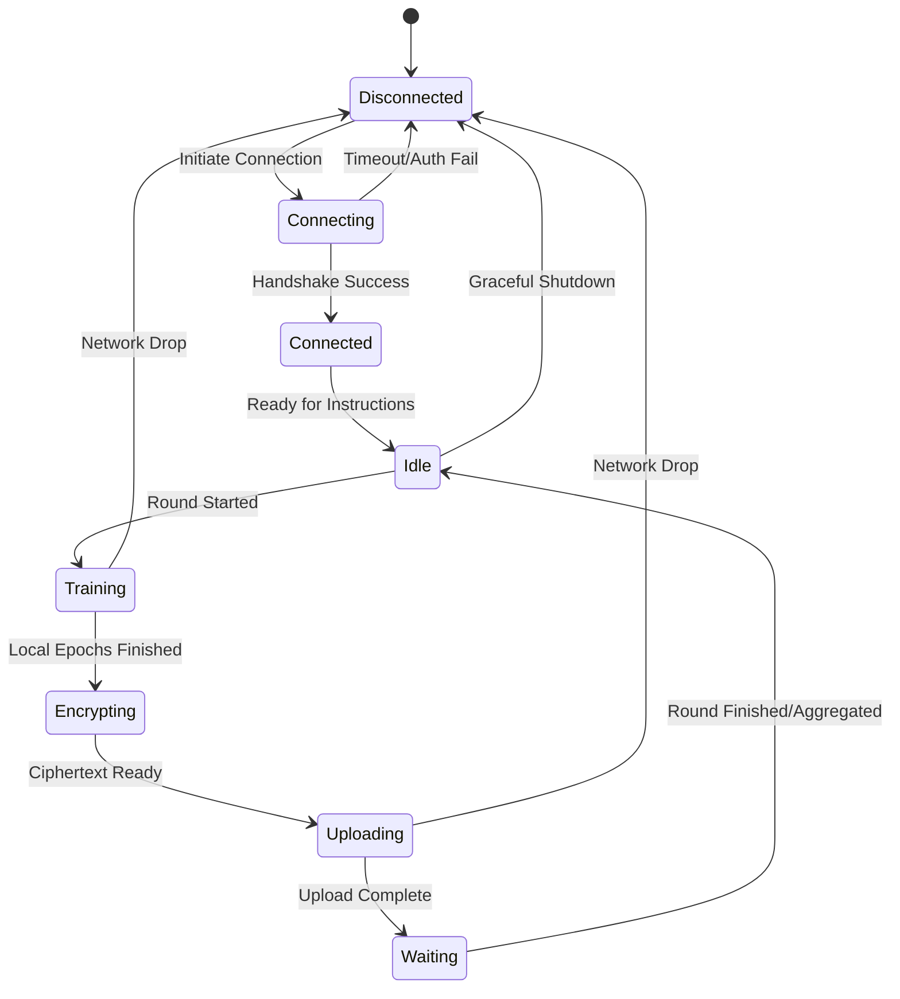
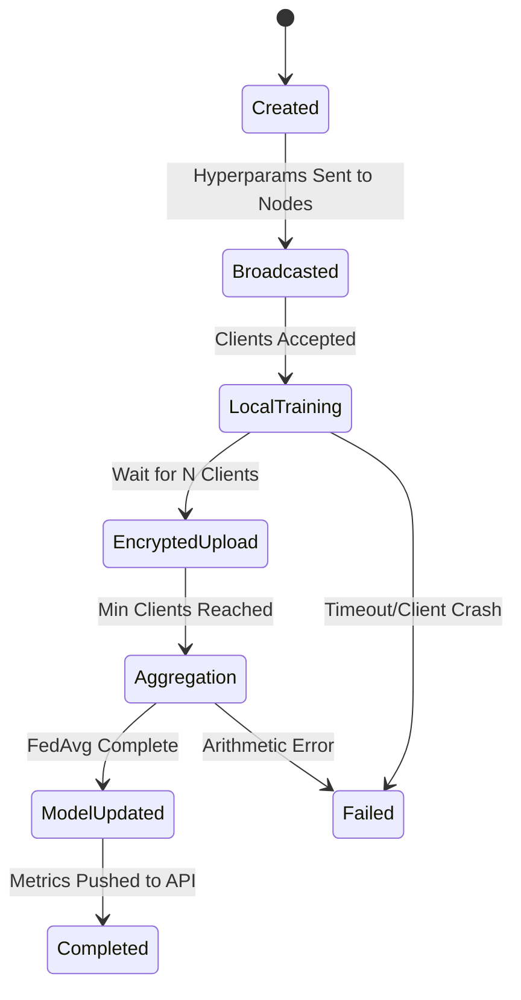

# System State Machines

**Parent Document:** [Platform Specification v1.1](platform_specification_v1.1.md)

## Hospital (Client Node) Lifecycle

```mermaid
stateDiagram-v2
    [*] --> Disconnected
    Disconnected --> Connecting : Initiate Connection
    Connecting --> Connected : Handshake Success
    Connecting --> Disconnected : Timeout/Auth Fail
    Connected --> Idle : Ready for Instructions
    Idle --> Training : Round Started
    Training --> Encrypting : Local Epochs Finished
    Encrypting --> Uploading : Ciphertext Ready
    Uploading --> Waiting : Upload Complete
    Waiting --> Idle : Round Finished/Aggregated
    
    Training --> Disconnected : Network Drop
    Uploading --> Disconnected : Network Drop
    Idle --> Disconnected : Graceful Shutdown
```

## Training Round Lifecycle

```mermaid
stateDiagram-v2
    [*] --> Created
    Created --> Broadcasted : Hyperparams Sent to Nodes
    Broadcasted --> LocalTraining : Clients Accepted
    LocalTraining --> EncryptedUpload : Wait for N Clients
    EncryptedUpload --> Aggregation : Min Clients Reached
    Aggregation --> ModelUpdated : FedAvg Complete
    ModelUpdated --> Completed : Metrics Pushed to API
    
    LocalTraining --> Failed : Timeout/Client Crash
    Aggregation --> Failed : Arithmetic Error
```
