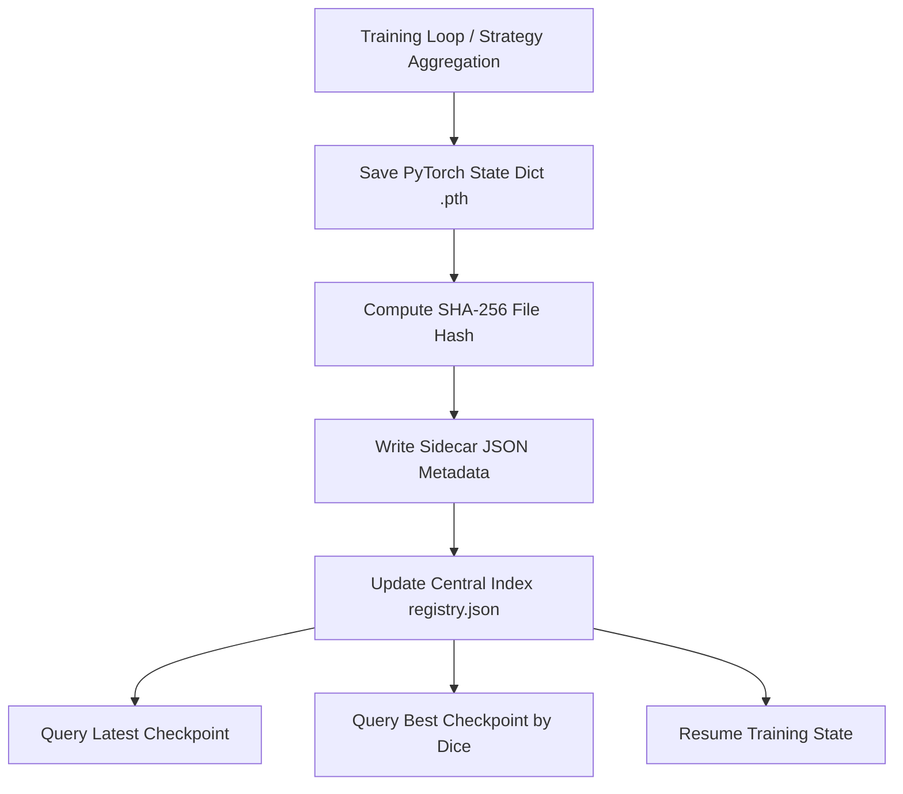

# FedMed v2.0 — Checkpoint Registry Engine

## Overview
The `CheckpointRegistry` (`utils/checkpoint_registry.py`) provides unified management, SHA-256 integrity verification, and metadata sidecar tracking for PyTorch model weights stored in `checkpoints/`.

## Checkpoint Lifecycle & Operations


## Checkpoint Metadata Sidecar (.json)
Each `.pth` file is accompanied by a matching `.json` sidecar:
- `checkpoint_id`: Unique identifier (`chk_<exp>_<round>_<ts>`)
- `file_path`: Path on filesystem
- `experiment_id`: Parent experiment ID
- `strategy`: Strategy name (`FedAvg`, `FedProx`, `CentralizedBaseline`)
- `round` / `epoch`: Training epoch or FL round number
- `dice`: Dice similarity score
- `loss`: Validation loss
- `file_hash`: Computed SHA-256 hash string
- `timestamp`: ISO GMT timestamp

## REST API Endpoints
```http
GET /api/v1/checkpoints
GET /api/v1/checkpoints/latest
GET /api/v1/checkpoints/best
```
