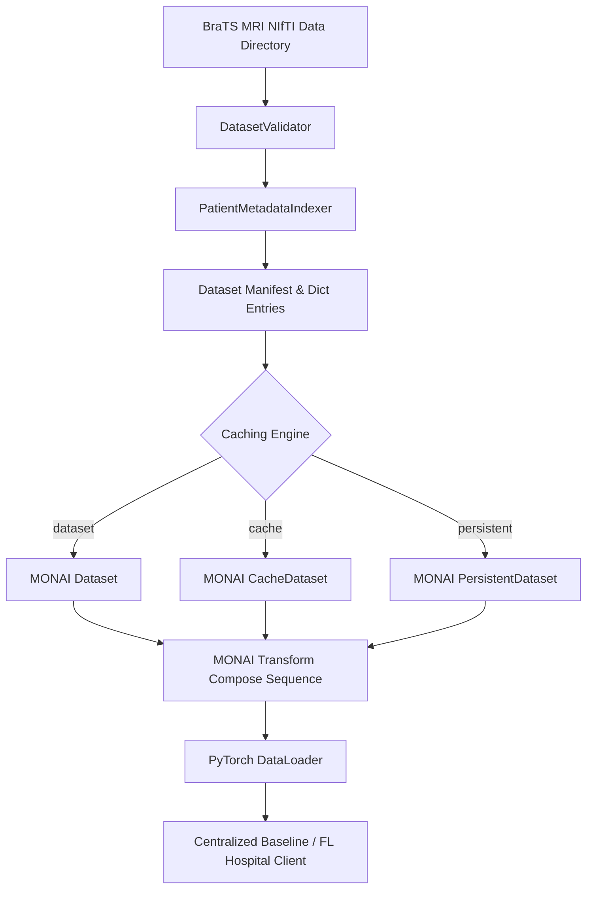

# FedMed Research Data Engine & Centralized Baseline Specification

## Overview
The FedMed Research Data Engine is a production medical imaging pipeline built on MONAI and PyTorch.
It supports multi-modal 3D MRI datasets (BraTS 2021, 2023, and future releases), automated dataset validation, metadata indexing, MONAI transform sequences, configurable caching strategies (`Dataset`, `CacheDataset`, `PersistentDataset`), and centralized baseline 3D UNet training.

---

## 1. Architecture Diagram

---

## 2. MONAI Transform Sequence

### Transform Descriptions
1. **LoadImaged**: Reads multi-modal NIfTI files (`t1`, `t1ce`, `t2`, `flair`, `seg`) into numerical array dictionaries.
2. **EnsureChannelFirstd**: Normalizes channel dimension ordering to `(C, D, H, W)`.
3. **Orientationd(axcodes="RAS")**: Standardizes anatomical scan orientation across hospital scanners.
4. **Spacingd(pixdim=(1.0, 1.0, 1.0))**: Resamples non-isotropic scans to uniform 1mm³ voxel dimensions.
5. **NormalizeIntensityd**: Z-score intensity normalization ($x = \frac{x - \mu}{\sigma}$) on non-zero brain voxels per channel.
6. **CropForegroundd**: Trims background zero voxels prior to spatial cropping.
7. **SpatialPadd & RandSpatialCropd**: Ensures uniform spatial dimensions `(128, 128, 128)`.
8. **RandFlipd & RandRotate90d**: 3D spatial augmentation.
9. **RandScaleIntensityd & RandShiftIntensityd**: Contrast & brightness jitter.
10. **EnsureTyped**: Converts arrays into PyTorch Tensors.

---

## 3. Caching Strategy
- **Standard Dataset (`dataset`)**: Reads and transforms NIfTI files dynamically per epoch. Lowest memory footprint, higher CPU I/O overhead.
- **RAM CacheDataset (`cache`)**: Pre-computes and caches deterministic preprocessing transforms in RAM. Ultra-fast epoch execution.
- **Disk PersistentDataset (`persistent`)**: Pre-computes and caches intermediate transformed volumes to disk (`.cache/monai/`). Fast execution across sessions with low RAM usage.

---

## 4. Checkpoint Lifecycle & Metrics
The centralized baseline trainer (`scripts/train_baseline.py`) manages:
- **`best_model.pth`**: Saved automatically whenever validation Dice score improves.
- **`last_model.pth`**: Saved at the end of every epoch for training resumption.
- **Convergence Plot (`checkpoints/baseline_convergence.png`)**: Automatically rendered training & validation loss and Dice curves.
- **Metrics Tracked**: Dice Score, IoU (Jaccard Index), 95th percentile Hausdorff Distance (mm), Precision, Recall, Training Loss, Validation Loss, Epoch Time (sec), GPU Memory (MB).

---

## 5. Future BraTS Compatibility
The `DatasetValidator` and `BraTSDataset` loader automatically discover subject subdirectories and matching NIfTI modality files matching patterns `*t1.nii*`, `*t1ce.nii*`, `*t2.nii*`, `*flair.nii*`, and `*seg.nii*`.
New dataset releases (e.g. BraTS 2023, BraTS 2024, or custom pediatric/glioma datasets) can be loaded immediately by setting `data_dir` in YAML configuration.
