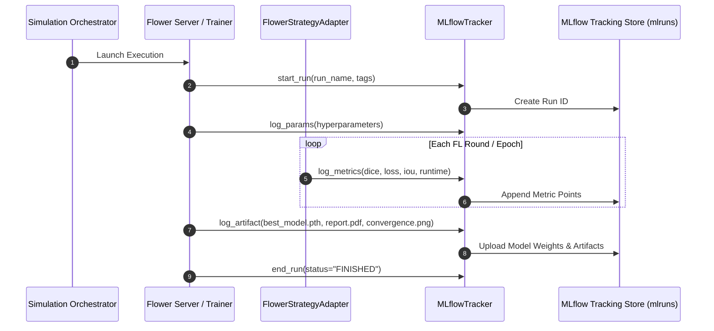

# FedMed v2.0 — Production MLflow Tracking Architecture

## Overview
FedMed v2.0 integrates MLflow tracking into both centralized baseline training (`train_baseline.py`) and federated Flower executions (`server.flower_server`).

## Architecture & Integration Flow


## Tracked Parameters & Metrics
- **Hyperparameters:** Strategy (`FedAvg`, `FedProx`), Dataset (`BraTS2021`), Partition Strategy (`Dirichlet`, `IID`), Dirichlet Alpha (`0.5`), Learning Rate (`1e-4`), Optimizer (`Adam`), Epochs (`1`), Batch Size (`2`), Random Seed (`42`), DP Enabled (`bool`), HE Enabled (`bool`), TLS Enabled (`bool`), Rounds (`3`), Clients (`3`).
- **Metrics:** MONAI Dice Score, Mean IoU, 95th Percentile Hausdorff Distance, Precision, Recall, Training Loss, Validation Loss, Aggregation Runtime, GPU Memory MB.
- **Uploaded Artifacts:** `best_model.pth`, `last_model.pth`, `baseline_convergence.png`, `summary.json`, `leaderboard.csv`, `report.pdf`.

## Usage & API Integration
Access tracking data programmatically via REST API:
```http
GET /api/v1/mlflow/status
GET /api/v1/mlflow/runs
```
