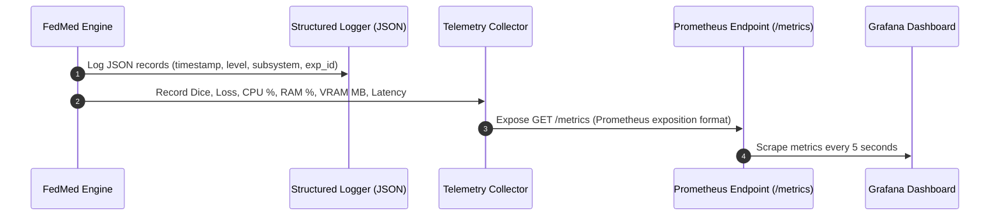

# FedMed v2.0 — Production Operations, Observability & Resilience Architecture

## Overview
This document details the operational architecture, observability pipeline, self-healing recovery, experiment resume mechanisms, Prometheus metrics exposition, Grafana dashboards, and SRE runbooks for **FedMed v2.0**.

---

## 1. System Architecture & Observability Data Flow



---

## 2. Centralized Structured Logging (`utils/logger.py`)

- **JSON Logs (`logs/fedmed.log`):** Ingested by ELK / Datadog / Grafana Loki.
- **Contextual Fields:** `timestamp`, `level`, `subsystem`, `experiment_id`, `hospital_id`, `round_id`, `filename`, `line`.
- **Colored Terminal Output:** For interactive local execution and debugging.

---

## 3. Prometheus Metrics Exposition (`/metrics`)

Endpoint: `GET /metrics` and `GET /api/v1/metrics-prometheus`

Exposed Metrics:
- `fedmed_dice_score`: Global model Dice similarity score
- `fedmed_training_loss`: Global model training loss
- `fedmed_system_cpu_percent`: System CPU utilization (%)
- `fedmed_system_ram_percent`: System RAM memory utilization (%)
- `fedmed_system_ram_used_gb`: System RAM memory used (GB)
- `fedmed_system_disk_percent`: Storage disk space used (%)
- `fedmed_system_gpu_vram_used_mb`: CUDA VRAM memory allocated (MB)

---

## 4. Automatic Experiment Resume Engine (`utils/resume_engine.py`)

If `run_simulation.py`, `train_baseline.py`, or `run_benchmarks.py` is interrupted by SIGINT / node failure:
1. `ExperimentResumeEngine` scans `checkpoints/registry.json`.
2. Locates the latest valid state checkpoint (`fl_round_<N>.pth`).
3. Restores global model parameters and begins training at Round $N+1$.

---

## 5. Distributed System Health API

Endpoint: `GET /api/v1/system/health`

Response:
```json
{
  "status": "HEALTHY",
  "latency_ms": 1.45,
  "components": {
    "backend_api": {"status": "HEALTHY"},
    "flower_server": {"status": "HEALTHY"},
    "checkpoint_registry": {"status": "HEALTHY"}
  },
  "hospitals": {
    "hospital_alpha": {"status": "ONLINE", "active_round": 1, "reconnect_count": 0}
  },
  "resources": {
    "cpu_percent": 15.2,
    "ram_used_gb": 4.2
  }
}
```

---

## 6. SRE Operational Runbook

### Handling Port Collisions:
```bash
# Check listening processes on ports 8000 and 8080
lsof -i :8000 -i :8080
# Force terminate stale processes
kill -9 <PID>
```

### Checking System Health:
```bash
curl -s http://127.0.0.1:8000/api/v1/system/health | jq .
```

### Exporting Grafana Dashboards:
Import `configs/grafana_dashboard.json` into your Grafana instance connected to Prometheus scraper `http://127.0.0.1:8000/metrics`.
