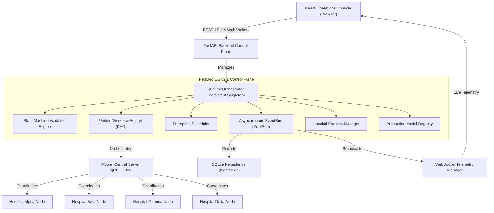
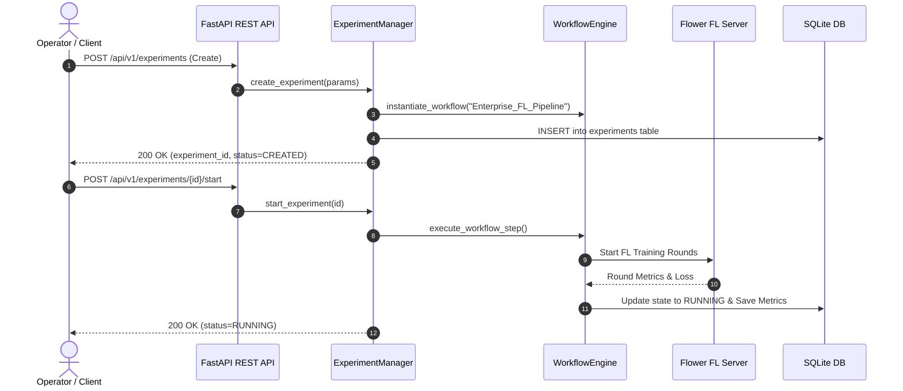
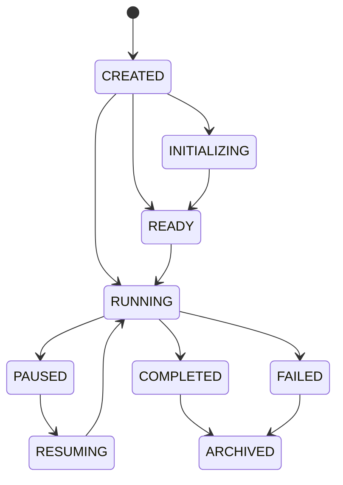
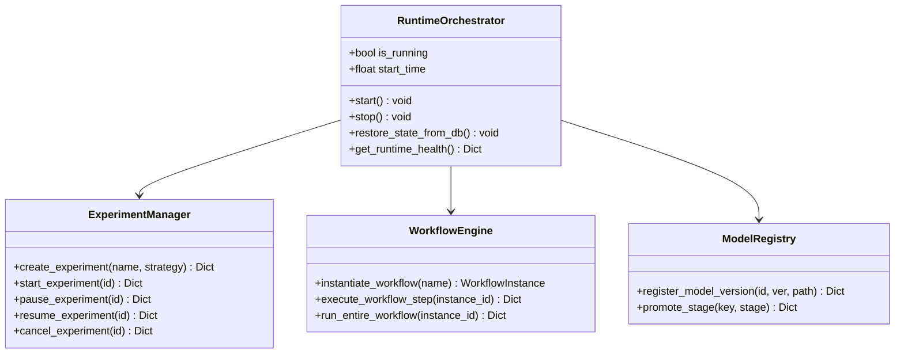

# FedMed OS v2.1 — Autonomous FLOS Architecture & Operational Runbook

---

## 1. Runtime Architecture Diagram



---

## 2. Sequence Diagram: REST-Driven Experiment Execution



---

## 3. Deterministic State Transition Matrix



---

## 4. Class Diagram: FLOS Control Plane Subsystems



---

## 5. REST API & WebSocket Event Catalogs

### Key REST Endpoints

| Method | Path | Subsystem | Description |
| :--- | :--- | :--- | :--- |
| `GET` | `/api/v1/runtime/health` | Runtime | Returns CPU, RAM, active experiments, connected nodes, WS count |
| `GET` | `/api/v1/runtime/status` | Runtime | Returns OS state, workflows, scheduled jobs, hospital nodes |
| `POST` | `/api/v1/runtime/restart` | Runtime | Triggers control plane state reload and orchestrator restart |
| `POST` | `/api/v1/experiments` | Experiment | Creates a new FL experiment and attaches workflow DAG |
| `POST` | `/api/v1/experiments/{id}/start` | Experiment | Starts workflow execution |
| `POST` | `/api/v1/experiments/{id}/pause` | Experiment | Pauses running experiment |
| `POST` | `/api/v1/experiments/{id}/resume` | Experiment | Resumes paused experiment |
| `POST` | `/api/v1/experiments/{id}/cancel` | Experiment | Cancels running experiment |

### WebSocket Event Stream (`/api/v1/telemetry/ws`)

| Event Type | Payload Attributes | Description |
| :--- | :--- | :--- |
| `metrics_updated` | `round_number`, `training_loss`, `dice_score` | Live training round metrics stream |
| `node_status_changed` | `hospital_id`, `status`, `timestamp` | Hospital connection state change |
| `autonomous_decision` | `decision`, `rationale`, `severity` | Autonomous OS decision recommendation |
| `stage_promoted` | `model_id`, `version`, `new_stage` | Production model promotion notification |

---

## 6. Operational Runbook & Troubleshooting

### Operational Command Quick Reference

```bash
# 1. Start Persistent Control Plane Backend
uvicorn dashboard.backend.app.main:app --host 127.0.0.1 --port 8000 --reload

# 2. Run Zero-Setup Autonomous REST Client Demo
python demo.py

# 3. Run Full Negative-Path & Chaos Test Suite
./venv/bin/pytest tests/integration/test_runtime_recovery_and_negative_paths.py -v

# 4. Run Complete Platform Test Suite (258+ Tests)
./venv/bin/pytest -v
```

### Common Failure Modes & Resolution Procedures

1. **Hospital Heartbeat Missed (>30s)**:
   - *Diagnostic*: RuntimeOrchestrator logs `Hospital 'hospital_alpha' missed heartbeat (>30s)`.
   - *Automated Recovery*: SelfHealingRecoveryEngine resets connection state and re-establishes node registration.
   - *Manual Action*: Trigger recovery via REST: `POST /api/v1/autonomous/self-healing/recover` with `{"node_id": "hospital_alpha", "failure_type": "Manual Reconnect"}`.

2. **Backend Process Restart**:
   - *Diagnostic*: Backend process killed or restarted.
   - *Automated Recovery*: `RuntimeOrchestrator.restore_state_from_db()` automatically queries SQLite `experiments` and `hospital_nodes` tables to rebuild active state in memory without losing experiment history.
