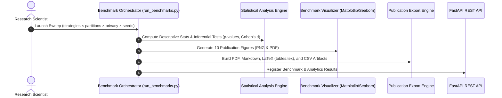

# FedMed v2.0 — Publication & Research Benchmarking Architecture

## Overview
This document describes the publication benchmark suite pipeline, LaTeX export format, and research paper reproducibility integration.

## Workflow Sequence


## LaTeX Table Integration (`tables.tex`)
Include `tables.tex` directly in your LaTeX research manuscript:

```latex
\input{results/benchmark_bm_1786208050/tables.tex}
```

## REST API Analytics Endpoints
```http
GET /api/v1/benchmarks/{id}/analytics
GET /api/v1/benchmarks/{id}/statistical-tests
GET /api/v1/benchmarks/{id}/latex-tables
GET /api/v1/benchmarks/{id}/plots
```
