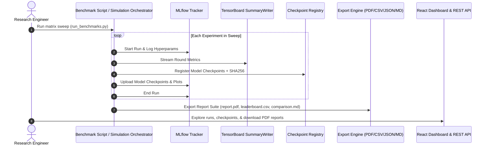

# FedMed v2.0 — End-to-End Research Workflow Guide

## Overview
This guide documents the end-to-end research lifecycle for running simulations, benchmarking strategy configurations, tracking experiment metrics, exploring research artifacts, and exporting publication-grade reports.

## End-to-End Research Pipeline


## Quick Start Commands
1. **Centralized Baseline Training:**
   ```bash
   python scripts/train_baseline.py --config configs/default.yaml --epochs 5
   ```
2. **Federated Simulation Execution:**
   ```bash
   python scripts/run_simulation.py --partition dirichlet --alpha 0.5 --enable-tls
   ```
3. **Automated Matrix Sweep Benchmarking:**
   ```bash
   python scripts/run_benchmarks.py --quick
   ```
4. **Launch TensorBoard UI:**
   ```bash
   tensorboard --logdir runs/
   ```
5. **Access Research Dashboard:**
   Open browser at `http://127.0.0.1:8000/` or inspect `/api/v1/openapi.json`.
