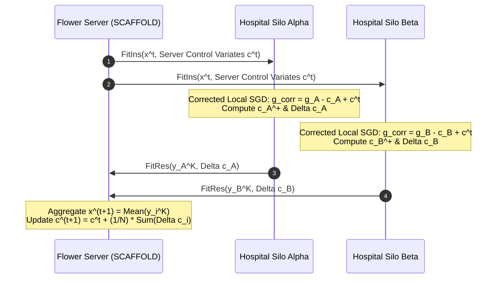

# FedMed v2.0 — SCAFFOLD Advanced Federated Optimization Engine

## Overview
This document details the theory, architecture, mathematical update rules, control variate sequence flows, and migration guidelines for **SCAFFOLD** (*Stochastic Controlled Averaging for Federated Learning*, Karimireddy et al., ICML 2020) implemented in **FedMed v2.0**.

---

## 1. Mathematical Formulation & Update Rules

### Client Local Update ($k = 0, \dots, K-1$)
Each client $i \in \mathcal{S}$ initializes local model $y_i^0 = x^t$. At local step $k$:
$$y_i^{k+1} = y_i^k - \eta \cdot \Big( g_i(y_i^k) - c_i^t + c^t \Big)$$
where:
- $g_i(y_i^k) = \nabla \mathcal{L}_i(y_i^k; b)$ is the minibatch stochastic gradient.
- $c_i^t$ is the client's local control variate tensor.
- $c^t$ is the global server control variate tensor.

### Control Variate Update ($c_i^{t+1}$)
After $K$ local SGD steps, client $i$ updates its local control variate:
$$c_i^{t+1} = c_i^t - c^t + \frac{x^t - y_i^K}{K \eta}$$
The control variate update vector transmitted to the server is:
$$\Delta c_i^t = c_i^{t+1} - c_i^t = \frac{x^t - y_i^K}{K \eta} - c^t$$

### Server Aggregation
The server receives parameter updates $y_i^K$ and control variates $\Delta c_i^t$ from sampled clients $i \in \mathcal{S}$:
1. **Global Model Parameters:**
   $$x^{t+1} = x^t + \frac{\eta_g}{|\mathcal{S}|} \sum_{i \in \mathcal{S}} (y_i^K - x^t)$$
2. **Global Server Control Variate:**
   $$c^{t+1} = c^t + \frac{1}{N} \sum_{i \in \mathcal{S}} \Delta c_i^t$$
   where $N$ is total client count.

---

## 2. Sequence Diagram & Data Flow



---

## 3. Algorithm Comparison Matrix

| Feature | FedAvg | FedProx | SCAFFOLD |
|---|---|---|---|
| **Objective** | Sample Averaging | Proximal Loss Regularization | Variance-Reduced Drift Correction |
| **Client Drift Correction** | No | Partial (soft proximal constraint) | **Exact (Control Variates)** |
| **Heterogeneity Robustness** | Degrades on Non-IID | Moderate | **Optimal (Heterogeneity Independent)** |
| **Extra State Overhead** | None | None | Server $c$ & Client $c_i$ Variate Vectors |
| **Hyperparameters** | `lr` | `lr`, `proximal_mu` | `lr`, `control_variate_lr` |

---

## 4. Migration Guide

To switch existing FedMed training pipelines to SCAFFOLD:

### Via YAML Configuration:
```yaml
federated:
  strategy: "SCAFFOLD"
  learning_rate: 0.0001
  control_variate_lr: 1.0
```

### Via CLI Execution:
```bash
python scripts/run_simulation.py --config configs/scaffold.yaml
```

### Via Python API:
```python
from server.strategies import StrategyRegistry

scaffold_strategy = StrategyRegistry.create(
    "SCAFFOLD",
    min_fit_clients=2,
    control_variate_lr=1.0,
)
```
