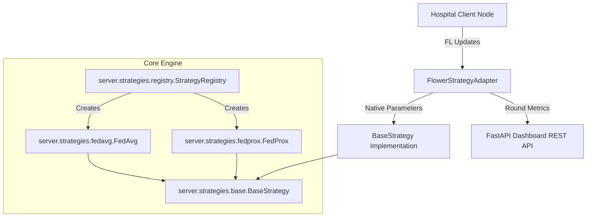
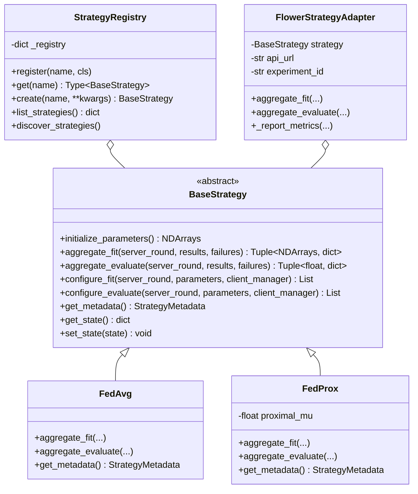
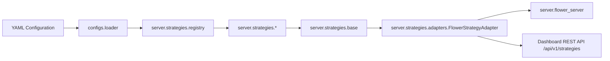

# FedMed Strategy Engine Architecture Specification

## Overview
The FedMed Strategy Engine provides a production-grade, framework-agnostic plugin architecture for federated learning aggregation algorithms.
It decouples mathematical parameter aggregation, control variates, and state management from transport protocols and server frameworks (such as Flower).

---

## 1. Architecture Diagram


---

## 2. Class Hierarchy


---

## 3. Dependency Graph


---

## 4. Migration Strategy
1. **Backward Compatibility**: Existing configuration files referencing `strategy: FedAvg` or `strategy: FedProx` at top-level or under `federated:` work without modification.
2. **Auto-Discovery**: Any new strategy file placed in `server/strategies/new_algorithm.py` with `@register_strategy("NewAlgorithm")` will be auto-discovered by `StrategyRegistry` with zero core code edits.
3. **Structured Configuration**: Advanced strategy configs can specify nested parameters:
```yaml
federated:
  strategy:
    name: FedProx
    parameters:
      proximal_mu: 0.05
```

---

## 5. Verification Commands
```bash
# Unit & Integration Tests
PYTHONPATH=. venv/bin/pytest tests/unit/test_strategy_registry.py tests/unit/test_fedavg.py tests/unit/test_fedprox.py tests/integration/test_strategy_switching.py

# Execute FedAvg Simulation
python scripts/run_simulation.py --config configs/fedavg.yaml

# Execute FedProx Simulation
python scripts/run_simulation.py --config configs/fedprox.yaml
```

---

## 6. Dashboard REST API Endpoints
- `GET /api/v1/strategies` -> Lists metadata summaries for all registered strategy plugins.
- `GET /api/v1/strategies/{strategy_name}` -> Returns detailed metadata, academic references, and hyperparameter specifications for the selected algorithm.
