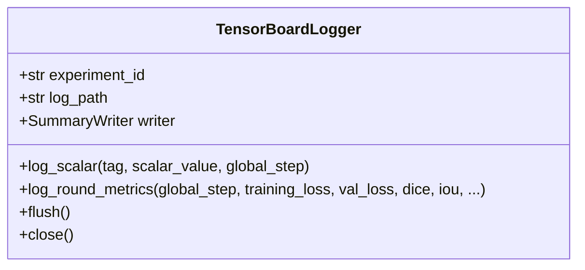

# FedMed v2.0 — TensorBoard Event Logging System

## Overview
FedMed v2.0 incorporates `TensorBoardLogger` (leveraging `tensorboardX` / `torch.utils.tensorboard`) to log high-frequency metric events directly to local disk directory `runs/`.

## Class Diagram


## Logged Event Metrics
1. **Loss Curves:** `Loss/Train`, `Loss/Validation`
2. **Segmentation Performance:** `Metrics/Dice`, `Metrics/IoU`
3. **Hyperparameters & Optimization:** `Hyperparameters/LearningRate`, `Optimization/GradientNorm`
4. **Privacy & Security:** `Privacy/Epsilon` (Differential Privacy budget)
5. **Hardware & Benchmarks:** `Hardware/GPUMemoryMB`, `Performance/RoundTimeSec`, `Performance/AggregationTimeSec`, `Performance/EncryptionTimeSec`

## Launch Command
To inspect live training curves:
```bash
tensorboard --logdir runs/
```

REST API endpoints:
```http
GET /api/v1/tensorboard/status
GET /api/v1/tensorboard/runs
```
